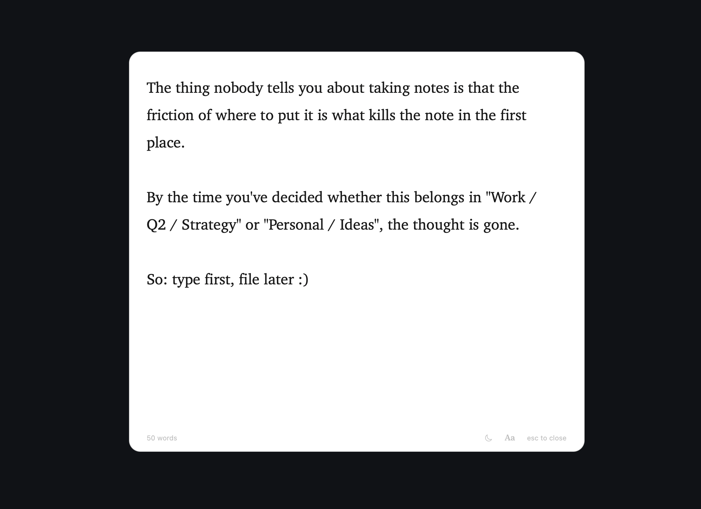

# Wisp

A dead-simple macOS scratchpad. Lives in your menu bar, opens with one click, gives you a clean surface to dump a thought, and gets out of the way.

Not a notes app. Not a todo app. Just a place for the thing you need to write down *right now*, before it's gone.

<p align="center">
  
</p>

## Install

Grab the latest `Wisp-X.Y.Z.zip` from [Releases](https://github.com/sulemaanhamza/wisp/releases), unzip, and drag `Wisp.app` to `/Applications`.

Wisp is unsigned (no Apple Developer account), so the first launch needs one of:

- Right-click `Wisp.app` → **Open** → confirm in the dialog, **or**
- `xattr -d com.apple.quarantine /Applications/Wisp.app`

After that it opens normally.

## Usage

Press **⌥Space** (Option+Space) from anywhere to summon the panel. Type. Press **Esc** to dismiss — the panel disappears, your text stays for next time.

You can also click the pencil icon in the menu bar to open it, or **right-click** the icon for a small menu with `Open Wisp` and `Quit Wisp`.

### Keyboard shortcuts

| Action               | Shortcut         |
| -------------------- | ---------------- |
| Open / dismiss panel | ⌥Space            |
| Bold / Italic        | ⌘B / ⌘I          |
| Smaller text         | ⌘1               |
| Default text         | ⌘2               |
| Larger text          | ⌘3               |
| Cut / Copy / Paste   | ⌘X / ⌘C / ⌘V    |
| Select All           | ⌘A               |
| Undo / Redo          | ⌘Z / ⇧⌘Z         |
| Quit Wisp            | ⌘Q               |
| Dismiss panel        | Esc              |

### Smart editing

- **Lists auto-continue.** Start a line with `- `, `* `, `+ `, `1. `, `A. `, or `a. ` and press Enter — the next marker appears on the new line. Pressing Enter on an empty list item exits the list.
- **Horizontal rule.** Type `---` on its own line and the moment you hit the third hyphen, it becomes a dim divider — no Enter required.
- **Bold and italic.** Select text and press ⌘B for `**bold**` or ⌘I for `*italic*`. The asterisks stay (it's still plain markdown on disk) but the run between them renders bold / italic inline. Hit the same shortcut again to unwrap.
- **Emoji shortcodes.** Type one of the curated codes and it expands the moment the trigger character lands: `:)` `:(` `:rocket:` `:fire:` `:heart:` `:check:` `:x:` `:star:` `:bulb:` `:warning:` → 🙂 🙁 🚀 🔥 ❤️ ✅ ❌ ⭐ 💡 ⚠️. Word shortcodes only fire after a space or line break so `Note:rocket:` mid-prose stays as you typed it.

### Headings

Lines starting with `# `, `## `, or `### ` (and so on, up to `######`) are recognised as section headings.

- They render **bolder and slightly larger** inline (`#` biggest, `##` smaller, `###+` same size as body but still bold).
- The top of the panel shows a sticky horizontal list of all your headings, separated by `·`. Click any one to jump to that section.
- Empty by default — the bar appears only when you have at least one heading, and disappears when you delete them.

It's still plain markdown on disk; the styling and the bar are purely render-time.

### Persistence

Your text is saved to `~/Library/Application Support/Wisp/scratchpad.md` — plain markdown, debounced 800ms after the last keystroke, and flushed on quit. Open it in any editor, back it up, or grep it. Nothing is locked in a proprietary database.

### Themes

Two surfaces, switchable from the small sun/moon button in the footer:

- **Dark glass** (default) — frosted translucent panel with warm off-white text. The "summon overlay" feel.
- **White slate** — opaque white card with near-black ink. The "clean page" feel.

Your choice is remembered across launches.

### Auto-update

On launch, Wisp quietly checks GitHub Releases. If a newer version exists, a small `↑ vX.Y.Z` appears next to the dismiss hint at the bottom. Click it once — the update downloads in the background, and the indicator switches to `↻ vX.Y.Z ready — restart to apply`. Quit and reopen Wisp (or click the indicator a second time) and the new version takes over. The download lives at `~/Library/Application Support/Wisp/Updates/`.

## Why

Existing notes apps (Obsidian, Notion, Bear, even Apple Notes) all ask you to think about *where* a note belongs before you can start writing. That friction kills fleeting thoughts. Wisp removes the choice — open, type, close.

## Design principles

- **One keystroke to open, Esc to dismiss.**
- **Empty by default.** The window is a blank surface, not a dashboard.
- **Chrome only when it earns its place.** A sticky heading bar appears only when you have headings; the update indicator shows up only when there's an update; the footer carries word count, theme toggle, font cycle, and dismiss hint at low contrast.
- **Plain markdown all the way down.** Lists, headings, dividers — all stored as the characters you typed. No proprietary format, no lock-in.
- **Minimal resources.** Native Swift / AppKit, sleeps when hidden.

## Build from source

Requires macOS 13+ and Swift 6.0+ (full Xcode not required — Command Line Tools is enough).

```bash
git clone https://github.com/sulemaanhamza/wisp.git
cd wisp
./scripts/build-app.sh 0.1.0
open build/Wisp.app
```

Or run directly without bundling:

```bash
swift run
```

## Status

Usable for daily writing. Working today: global hotkey, persistence to disk, in-app auto-update, smart list editing, instant horizontal rules, dimmed dividers, headings with click-to-jump navigation, light / dark themes, three font sizes. Roadmap from here is mostly polish — customizable hotkey, optional iCloud sync, maybe a Homebrew tap.

## License

MIT — see [LICENSE](LICENSE).
