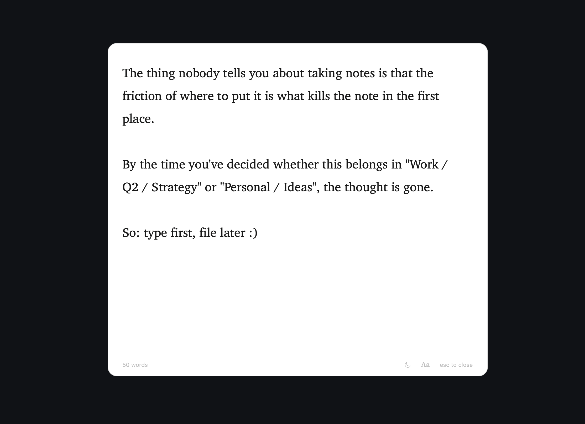

# Wisp

A dead-simple macOS scratchpad. ⌥Space to summon, type, Esc to dismiss.

[](https://github.com/sulemaanhamza/wisp/actions/workflows/ci.yml)

<p align="center">
  
</p>

## Install

Requires macOS 13 (Ventura) or later. Universal — Apple silicon and Intel.

**Homebrew**

```sh
brew tap sulemaanhamza/wisp
brew install --cask wisp
```

**Direct download**

Grab the latest zip from [Releases](https://github.com/sulemaanhamza/wisp/releases), unzip, drag `Wisp.app` to `/Applications`, then:

```sh
xattr -d com.apple.quarantine /Applications/Wisp.app
```

The `xattr` step is needed because Wisp isn't signed with an Apple Developer ID — it tells macOS the app is safe to open. Homebrew does this for you.

Rather not use Terminal? Open Wisp once and dismiss the warning, then go to **System Settings → Privacy & Security** and click **Open Anyway** next to Wisp.

## Features

- **⌥Space** to summon from anywhere (rebindable)
- **Light / dark / system** appearance — one-click cycle, follows macOS by default
- **Eight fonts** to pick from — serifs (Charter, Iowan Old Style, Hoefler Text, Palatino), and sans (Optima, Avenir Next, San Francisco, Verdana)
- **Smart editing** — lists auto-continue, `---` becomes a divider, `**bold**` and `*italic*` render inline
- **Checklists** — `- [ ]` continues on Enter; click a box to tick it off, or press ⌘L
- **Move lines** — ⌥↑ / ⌥↓
- **Links** — ⌘-click any `https://` link to open it
- **Headings** — `#`, `##`, `###` render styled with click-to-jump navigation
- **Code** — `` `inline` `` and ``` fenced blocks in monospace
- **Find** — ⌘F, with ↵ / ⇧↵ to step through matches
- **Archive to Inbox** — ⇧⌘↩ files the note by timestamp and clears the pad
- **Emoji shortcodes** — `:rocket:` `:fire:` `:heart:` `:check:` and more
- **Bold / Italic** — ⌘B / ⌘I
- **Text size** — ⌘- / ⌘= / ⌘0
- **Transparency** — choose how much desktop shows through
- **Version history** — timestamped copies kept locally, so a bad edit is recoverable
- **Auto-update** — downloads new versions in the background
- **Launch at Login** — toggle in the right-click menu
- **Plain markdown on disk** at `~/Library/Application Support/Wisp/scratchpad.md`
- **Sync across Macs** — point at any folder via the right-click menu (iCloud Drive, Dropbox, Syncthing all work)
- **On your iPhone** — keep the folder in iCloud Drive and open `scratchpad.md` in the Files app or any markdown editor
- **Multiple displays** — optionally opens on whichever screen the pointer is on

Click the `?` in the footer for the full keyboard shortcut list.

## Build from source

```sh
git clone https://github.com/sulemaanhamza/wisp.git
cd wisp
swift run
```

No Xcode needed — Command Line Tools are enough.

## Contributing

Run the test suite before sending a pull request:

```sh
swift run Wisp --test
```

See [CONTRIBUTING.md](CONTRIBUTING.md) for how Wisp is built and what
gets merged, and [ARCHITECTURE.md](ARCHITECTURE.md) for how it fits
together. Changes are listed in [CHANGELOG.md](CHANGELOG.md).

## License

MIT — see [LICENSE](LICENSE).
